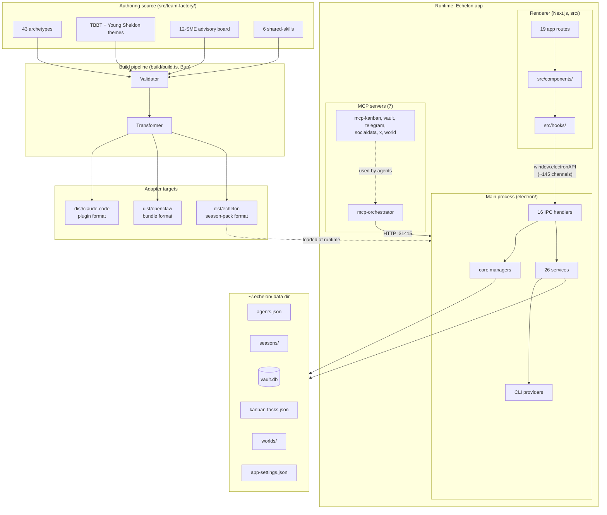
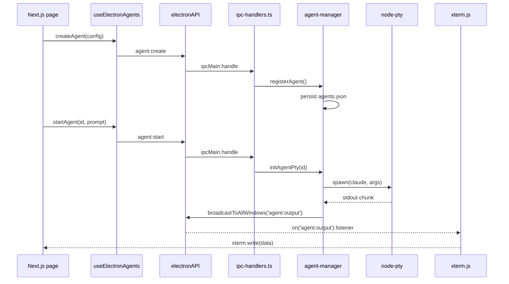
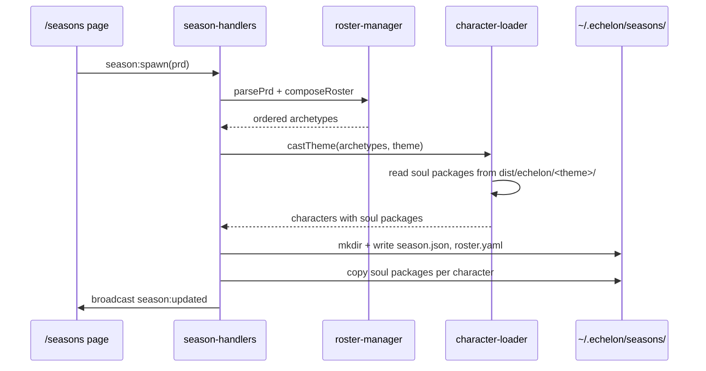
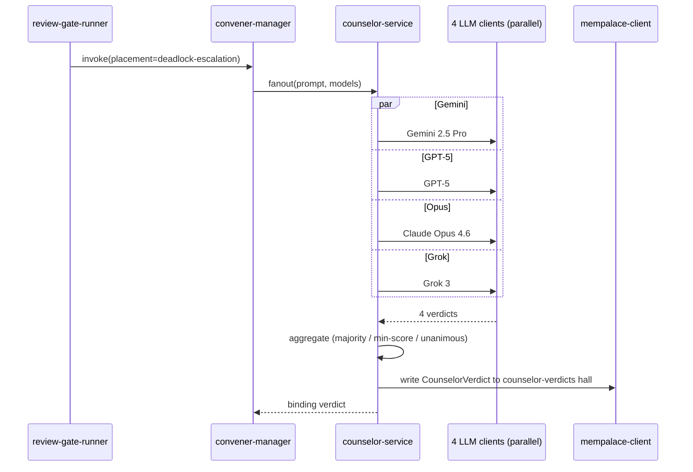

# Codebase Map

> Auto-generated by Cartographer. Last mapped: 2026-04-23.

Echelon is an Electron 33 + Next.js 16 desktop app that hosts the **factor-echelon** team-factory skill system. Users drop in a PRD; the app parses it, selects archetypal roles, casts each as a themed character (default: The Big Bang Theory), and spawns a **season** — an isolated workspace with git worktrees, per-character soul packages, a knowledge base, a 6-gate parallel review pipeline, and a 4-model counselor for high-stakes decisions. The authoring source lives in `src/team-factory/` and compiles to three adapter targets (`dist/claude-code`, `dist/openclaw`, `dist/echelon`) via `build/build.ts`.

## System Overview



## Directory Structure

```
echelon/
├── src/                         Next.js renderer
│   ├── app/           (53f)    App Router pages (19 routes) + API routes
│   ├── components/   (206f)    React component library (Tailwind + framer-motion)
│   │   ├── PokemonGame/        Full Game-Boy-style RPG overworld ("Pallet Town")
│   │   ├── CanvasView/         Infinite-canvas agent board
│   │   ├── AgentWorld/         3D isometric office (react-three-fiber)
│   │   ├── TerminalsView/      Multi-agent xterm grid (react-grid-layout)
│   │   ├── VaultView/          SQLite document store UI
│   │   ├── KanbanBoard/        @dnd-kit kanban with agent auto-sync
│   │   ├── Memory/             Live force-directed knowledge graph
│   │   ├── Settings/           15+ section settings panel
│   │   ├── TrayPanel/          macOS tray popover window
│   │   └── ...                 AgentList, Dashboard, Echelon (seasons),
│   │                           NewChatModal, ObsidianVaultView
│   ├── hooks/         (13f)    useElectron, useClaude, useAgents, etc.
│   ├── lib/            (8f)    claude-code, skills/plugins DB, generation/
│   ├── store/          (1f)    Zustand: sidebar, dark mode, selection, mock data
│   ├── types/          (6f)    Agent, Task, KanbanTask, GenerativeZone, electron.d.ts
│   ├── data/           (1f)    CHANGELOG
│   └── team-factory/ (485f)    ★ THE SKILL AUTHORING SOURCE (see Module Guide)
│       ├── archetypes/         43 role blueprints
│       ├── themes/             TBBT (30 chars) + Young Sheldon (13)
│       ├── advisory-board/     12 tech luminaries + Stephen Hawking (oracle)
│       ├── seasons/            Season lifecycle primitives
│       ├── counselor/          4-model council + 4 placement types
│       ├── shared-skills/      git-worktrees, kb-interface, quality-gate,
│       │                       review-gates, knowledge-capture/retrieval
│       ├── theme-engine/       Archetype → character casting
│       ├── roster-composer/    PRD → ordered roster
│       ├── protocols/          YAML schemas (soul, echelon-pack, roster, etc.)
│       ├── capabilities/       access-matrix.yaml (RBAC)
│       ├── oobe/               8-step first-run state machine
│       └── cli/                9 command families (season, character, kb, etc.)
├── electron/                    Main process
│   ├── main.ts                 Entry: createWindow, tray, API server, migrations
│   ├── preload.ts              contextBridge (IPC contract, ~145 channels)
│   ├── core/          (11f)    Stateful managers (window, agent, pty, season,
│   │                           roster, character, convener, review-gate, tray)
│   ├── handlers/      (16f)    IPC handler registration
│   ├── services/      (26f)    Cross-cutting services (api-server, bots,
│   │                           mcp-orchestrator, vault-db, mempalace-client,
│   │                           counselor-service, hooks-manager, ...)
│   ├── providers/      (7f)    CLI provider abstraction (claude, codex,
│   │                           gemini, opencode, pi)
│   ├── utils/          (9f)    broadcast, agents-tick, ansi, path-builder,
│   │                           statusline, decode-project-path
│   ├── constants/      (1f)    DATA_DIR, file paths, API_PORT=31415
│   ├── resources/, types/
│   └── CLAUDE.md               Electron-specific agent guidance
├── mcp-orchestrator/           Master control plane MCP server
│   └── src/          (10f)     Agents, messaging, scheduler, automations
├── mcp-kanban/         (1f)    Shared task board MCP
├── mcp-vault/          (5f)    Document store MCP
├── mcp-telegram/       (1f)    Telegram messaging MCP
├── mcp-socialdata/     (5f)    Read-only Twitter/X data MCP
├── mcp-x/              (4f)    Post/reply on X (OAuth 1.0a) MCP
├── mcp-world/          (3f)    Generative game zones MCP (parked)
├── __tests__/         (38f)    Vitest: electron, mcp, components, cron-parser
│                               — the only CI-run suite
├── tests/             (42f)    Bun test: e2e, integration, smoke, unit, fixtures
│                               — comprehensive but NOT in CI
├── build/                      Skill build pipeline (Bun, zod, tsc)
├── adapters/                   openclaw, echelon, claude-code adapter configs
├── .claude/skills/   (64f)     Project-level Claude Code skills (NOT team-factory output)
├── docs/                       specs/, superpowers/plans/, concepts/, guides/,
│                               positioning/, examples/, architecture/, release/
├── hooks/             (10f)    Claude Code session lifecycle bash hooks
├── scripts/            (3f)    notarize.js, icon generators
├── slide-deck/         (5f)    18-slide AI dev education deck (marketing)
├── landing/           (10f)    Standalone Next.js marketing site (STILL DOROTHY-BRANDED)
├── skills/                     world-builder/ + remember.md
└── (root configs: package.json, tsconfig*.json, biome.json, eslint.config.mjs,
    vitest.config.mts, next.config.ts, mempalace.yaml, CLAUDE.md, README.md)
```

## Module Guide

### src/team-factory/ — The Skill Authoring Source

**Purpose:** Compiles to three adapter targets. An **archetype** is what an agent does (role blueprint). A **theme character** is who it is (voice, mannerisms, soul package). Cast = archetype × theme.

**Archetype anatomy** (3 files, consistent across all 43):
- `archetype.yaml` — name, tier (medium/large/enterprise), role_summary, typed inputs/outputs
- `capabilities.yaml` — required capability scopes (e.g., `source-control:write`)
- `description.md` — "When this fires / When it stops"

**Soul package** (lives in `themes/<theme>/characters/<name>/`, validated by `protocols/soul-schema.yaml`):
- `SOUL.md` — first-person identity + hard guardrails (required)
- `AGENTS.md` — operational runbook (required)
- `HEARTBEAT.md` — cadence (required)
- `MEMORY.seed.md` — seed facts that drift at runtime (required)
- `persona.md` — prose style, mannerisms (optional but always present)

**Build:** `bun run skill:build` → `parseSkillTree` → `validateSkillTree` (zod) → `build{ClaudeCode,OpenClaw,Echelon}`. The echelon target produces one subdir per theme (e.g., `dist/echelon/tbbt/`). `npm run dev` runs `skill:build:echelon` first, so the Electron app always boots with a fresh pack. **Coupling is through the compiled `dist/` artifact, not module imports** — no TypeScript imports from `src/team-factory/` in `src/app/` or `electron/`.

**Counselor:** 4-model council (Gemini 2.5 Pro, GPT-5, Opus 4.6, Grok 3) with 4 placement types:
| ID | Trigger | Consensus |
|----|---------|-----------|
| A — Skill Promotion | pending skill approval | unanimous ≥4 |
| B — Design Review | architecture change | 3 of 4 ≥4 |
| C — Deadlock Escalation | gate bounced / deadlock | majority (binding) |
| D — High-Risk Adversarial | security gate ≤3 | majority |

Convener per theme (TBBT = Stephen Hawking) fires the 4 parallel calls and writes `CounselorVerdict` to mempalace `counselor-verdicts` hall.

**CLI (9 families):** `season`, `character`, `scope`, `cancel`, `kb`, `override`, `rerun`, `counselor`, `uninstall`.

### src/components/ — React Component Library

**Pattern:** Tailwind utility classes + framer-motion overlays. No CSS modules, no `cn()` helper. Dark mode via `.dark` class on `<html>`. All IPC via `window.electronAPI.<namespace>.<method>` with optional-chain guards; no centralised abstraction. framer-motion for modals, react-three-fiber for AgentWorld, `@dnd-kit` for KanbanBoard, react-grid-layout for TerminalsView, xterm.js everywhere terminals appear.

**PokemonGame** is the `/pallet-town` route: a Game Boy-style overworld where real agents are wandering NPCs and buildings portal into Echelon features (Skill Dojo, Claude Lab, Kanban, Plugin Shop, Scheduler, Settings, Vercel HQ). Route 1 has random battles; the World Gate opens AI-generated zones via `/api/generate-zone` SSE. Force-collapses sidebar on mount. The web-mode / desktop-mode split has two completely different code paths for world generation (`fetch` vs real agent spawn) — see Gotchas.

**AgentWorld** is a 3D isometric office (react-three-fiber) with agents as animated characters at workstations. `AgentTerminalDialog` is a heavy slide-over shared across PokemonGame, CanvasView, and AgentWorld.

### electron/ — Main Process

**Entry (`main.ts`)**: `ensureDataDir()` → write `~/.echelon/CLAUDE.md` → install statusline → run Dorothy→Echelon + Claude-Manager migration → `loadAgents` + `loadSeasons` → `createWindow` (1600×1000, hiddenInset, `app://` protocol in prod) → `initTray` → register IPC handler groups → `initVaultDb` → `initTelegramBot` + `initSlackBot` + `initApiServer(31415)` → `setupMcpOrchestrator` → `configureStatusHooks` → `initAutoUpdater`.

**IPC contract (`preload.ts`)**: ~120 invoke channels + ~25 push channels, ~145 total, grouped into 28 namespaces:

| Namespace | Channels | Key handlers |
|-----------|----------|--------------|
| `pty` | 6 | create, write, resize, kill, data (on), exit (on) |
| `agent` | 16 | create, update, start, get, list, stop, remove, input, resize, setSecondaryProject + 6 push (output, error, complete, tool_use, status, tick) |
| `skill` | 12 | install*, pty*, list-installed, fetch-marketplace, link-to-provider |
| `plugin` | 6 | install-start/write/resize/kill, pty-data/exit |
| `fs`, `claude` | 2 | list-projects, getData |
| `settings`, `appSettings` | 6 | get/save + `settings:updated` push |
| `telegram`, `slack`, `jira`, `socialData`, `xApi` | 9 | test/sendTest patterns |
| `gws` | 7 | detect, detectGcloud, authStatus, setup, remove, getMcpStatus, listSkills |
| `tasmania` | 8 | test, getStatus, getModels, loadModel, stopModel, getMcpStatus, setup, remove |
| `dialog`, `shell` | 11 | folder/file/audio pickers, open-terminal, exec, quick PTY |
| `orchestrator` | 3 | getStatus, setup, remove |
| `scheduler` | 11 | CRUD + logs + watch/unwatch + 2 push |
| `automation` | 6 | list, create, update, delete, run, getLogs |
| `kanban` | 11 | CRUD + move, reorder, generate + 3 push |
| `vault` | 13 | docs + folders + search + attachFile + 3 push |
| `world` | 8 | listZones, getZone, export/import/confirmImport, delete + 2 push |
| `mcp`, `cliPaths` | 6 | custom MCP config + binary detection |
| `updates` | 9 | check, download, quitAndInstall, openExternal + 5 push |
| `memory` | 5 | list-projects, read/write/create/delete-file |
| `obsidian` | 7 | scan, readFile, writeFile, getVaultInfo, detectVault, add/remove |
| `api`, `tray` | 4 | getToken, showMainWindow, quit, focus-agent (push) |
| `reviewGate` | 4 | run, status, list + updated push |
| `kb` | 5 | query, write, promote-skill, audit, status |
| `convener`, `season` | 9 | season CRUD + characters + convener get/invoke + updated push |
| `counselor` | 3 | invoke, placements, history |

**Handlers (`electron/handlers/`, 16 files):**
- `ipc-handlers.ts` — master registration (pty, agent, skill, plugin, fs, claude, settings, bots, integrations, dialog, shell, orchestrator)
- Feature-scoped: `scheduler-handlers`, `automation-handlers`, `kanban-handlers`, `vault-handlers`, `memory-handlers`, `obsidian-handlers`, `review-gate-handlers`, `kb-handlers`, `convener-handlers`, `season-handlers`, `counselor-handlers`, `world-handlers`, `cli-paths-handlers`, `gws-handlers`, `mcp-config-handlers`

**Services (`electron/services/`, 26 files):**
- `api-server.ts` — HTTP on :31415 with bearer-token auth; REST routes power external agent control
- `claude-service.ts` — reads `~/.claude/` (settings, stats, projects, plugins, skills, history)
- `telegram-bot.ts`, `slack-bot.ts` — bot integrations with command handling
- `mcp-orchestrator.ts` — manages bundled orchestrator MCP + sidecars
- `vault-db.ts` — `better-sqlite3` WAL-mode wrapper around `~/.echelon/vault.db`
- `memory-service.ts`, `obsidian-service.ts` — filesystem browsers
- `kanban-automation.ts` — watches tasks moving to `planned`, auto-spawns agents
- `hooks-manager.ts` — writes Claude Code session hooks into each provider's config
- `update-checker.ts` — electron-updater wrapper; checks `jediswimmer/echelon`
- `kb-bridge.ts` + `mempalace-client.ts` — KB abstraction over mempalace MCP subprocess
- `counselor-service.ts` — **STUBBED** — returns mock verdicts
- `tasmania-client.ts` — local LLM HTTP client
- `api-routes/` — Express-style route handlers (agent, kanban, vault, scheduler, slack, telegram, hooks, health)

**Core managers (`electron/core/`, 11 files):** `window-manager` (title still "Dorothy" — leftover), `agent-manager` (authoritative `Map<id,AgentStatus>`), `pty-manager` (4 PTY maps), `season-manager`, `roster-manager`, `character-loader`, `convener-manager`, `review-gate-runner` (**STUBBED**), `tray-manager`, `tray-panel-manager`.

**Providers (`electron/providers/`, 7 files):** Multi-CLI abstraction via `CLIProvider` interface. Concrete: Claude, Codex, Gemini, OpenCode, Pi. `getProvider(id)` falls back to Claude for unknown types.

**Constants (`electron/constants/index.ts`):**
```
DATA_DIR           = ~/.echelon/
AGENTS_FILE        = ~/.echelon/agents.json
APP_SETTINGS_FILE  = ~/.echelon/app-settings.json
KANBAN_FILE        = ~/.echelon/kanban-tasks.json
VAULT_DIR          = ~/.echelon/vault/
VAULT_DB_FILE      = ~/.echelon/vault.db
API_TOKEN_FILE     = ~/.echelon/api-token
TELEGRAM_DOWNLOADS = ~/.echelon/telegram-downloads/
API_PORT           = 31415
GITHUB_REPO        = jediswimmer/echelon
OLD_DATA_DIR       = ~/.claude-manager/   (migration source)
LEGACY_DOROTHY_DIR = ~/.dorothy/          (migration source)
```

### MCP Servers (7)

All expose tools for agents to act on Echelon state. `mcp-orchestrator` is the master control plane (bridges to the Electron HTTP API at :31415 with bearer token); the rest are feature-scoped.

| Server | Purpose | Tool count |
|--------|---------|-----------|
| `mcp-orchestrator` | Agents, messaging, scheduler, automations | ~27 (9 agents, 2 messaging, 6 scheduler, 10 automations) |
| `mcp-kanban` | Task board on `~/.echelon/kanban-tasks.json` | 8 |
| `mcp-vault` | Document store (calls Electron REST) | 10 |
| `mcp-telegram` | Direct Telegram send (bypasses Electron) | 4 |
| `mcp-socialdata` | Read-only Twitter/X via SocialData API | 5 |
| `mcp-x` | Post/reply/delete on X (OAuth 1.0a) | 3 |
| `mcp-world` | Generative game zones (parked) | 6 |

`mcp-orchestrator`'s automation engine polls GitHub (`gh` CLI), JIRA (REST v3 with ADF extraction), and stubbed Pipedrive/Twitter/RSS. Output handlers post to Telegram, Slack, GitHub PR/issue comments, JIRA comments + status transitions, and arbitrary HTTPS webhooks (with SSRF protection — private IP ranges blocked). On trigger, creates a disposable agent, polls to completion, deletes it. `delegate_task` is the primary coordination primitive.

## Data Flow

### Agent spawn + terminal streaming



### Season spawn



### Counselor invocation (STUBBED in v0.1)



## Conventions

- **TypeScript strict mode everywhere.** `tsconfig.base.json` sets `strict`, `esModuleInterop`, `skipLibCheck`, `forceConsistentCasingInFileNames`. Three downstream configs: renderer (`tsconfig.json`, bundler resolution, `@/*` → `src/*`), main (`electron/tsconfig.json`), and per-MCP.
- **IPC channel naming:** `domain:verb` everywhere (`agent:start`, `kanban:move`, `vault:document-created`).
- **Push events return unsubscribe:** `const unsub = api.agent.onTick(cb); useEffect(() => unsub, [])` — prevents listener leaks.
- **Web-mode degradation:** Every component that uses `window.electronAPI` guards with optional chaining and renders a `VaultEmptyState`-style fallback or degrades silently. No centralised `isElectron()` gate — each consumer handles its own fallback.
- **Styling:** Tailwind utilities only. Dark mode via `.dark` on `<html>` plus CSS custom properties (`bg-card`, `text-foreground`, `border-border`). framer-motion for all overlays.
- **Linting:** Biome handles formatting + basic lint (2-space, 100 char). ESLint handles Next.js-specific rules. Both coexist by scope.
- **Testing split:** `__tests__/*.test.ts` runs under Vitest. `tests/*.test.ts` runs under Bun (`from "bun:test"`). These are **two separate test harnesses with no CI bridge.**
- **Data persistence:** All user state under `~/.echelon/`. JSON files for lists, SQLite (WAL) for vault docs, YAML for season/roster manifests.
- **Commit attribution:** No `Co-Authored-By: Claude` lines (user preference).

## Gotchas

### Spec vs reality gap
- `counselor-service.ts` returns **mock verdicts**; no real multi-model fan-out yet.
- `review-gate-runner.ts` 7 gates are all **stubs**.
- The `tests/` Bun suite imports ~15 modules from `build/` (oobe, ingestion, runtime, counselor, expansion, kb) that likely won't exist until Plans 1–10 complete. Those tests fail on import.
- `kb promote` CLI command is **explicitly marked v0.5**.
- `star-wars` theme is listed but stubbed in v0.1.
- `mempalace` external dep pin is a **placeholder SHA**.
- `openclaw` external dep pin is `pin_type: TBD`.

### Rebrand leftovers (Dorothy → Echelon)
- Main window title is still **"Dorothy"** in `window-manager.ts`.
- `scripts/notarize.js` prefers keychain profile **`'Dorothy'`** instead of `'Echelon'`.
- `LICENSE` copyright is still **"2025 Claude Manager Contributors"**.
- `landing/` site is **entirely Dorothy-branded** (assets under `landing/public/dorothy/`).
- Migration code runs Dorothy→Echelon + Claude-Manager→Echelon on startup — required because the data dir was `~/.claude-manager/` then `~/.dorothy/`.

### Fragile build steps
- `electron:build` npm script manually **backs up `src/app/api` and `src/app/icon.tsx`** before Next.js static export (to avoid API-route conflicts with `output: 'export'`), then restores in a `trap`. Any crash mid-build leaves the repo broken.
- `next.config.ts` has a **hardcoded Tailscale IP** (`100.92.4.122`) in `allowedDevOrigins` — should not be committed.
- Both Bun and npm toolchains are required: `skill:build` needs Bun, `electron:build` and tests need npm.

### CI coverage holes
- `pr.yml` runs **only Vitest** (`__tests__/`) with one file excluded (`hooks-routes.test.ts` — native-module dependency).
- All **Bun tests in `tests/` are zero-coverage in CI** — 18 integration tests + 3 E2E + 4 smoke never run.
- `mcp-world`, `mcp-x`, `mcp-socialdata` have **no test files** in `__tests__/mcp/`.
- Smoke tests require `dist/` to exist; CI test job doesn't build.

### Subtle behavioural traps
- **PokemonGame screen state machine** has 8 values in `index.tsx` but `GameCanvas` only receives a simplified 4-value version — mismatches silently freeze input.
- **PokemonGame world generation** has two fully different code paths (web SSE fetch vs real Electron agent spawn) for the same UX action.
- **TerminalsView agent start** is deferred until the terminal mounts (`pendingStartRef` + `onTerminalReady`). If the grid layout has no free slot, the agent is created but never started, silently.
- **Memory knowledge graph** shells out `cat ~/.claude/mcp.json` — returns null if file is missing or malformed JSON, with no user signal.
- **VaultView unread tracking** uses `localStorage.getItem(READ_DOCS_KEY) === null` as the trigger for "mark all existing as read". Clear localStorage externally and every document looks unread again.
- **Kanban auto-sync** has no debounce. Agent tick storms can cause cascading `moveTask` calls.
- **`adversarial-reviewer` and `developer-advocate`** both map to Wil Wheaton in TBBT (one character, two roles).
- `mempalace.yaml` references **`plan 12`** and a **`convener`** keyword that don't appear anywhere in the current spec or docs.
- The `.claude/skills/` directory is **NOT** team-factory output. It's the app's own dev skills (`component-refactoring`, `vercel-react-best-practices`, `web-design-guidelines`). Team-factory output goes to `dist/claude-code/`.
- `src/lib/agent-manager.ts` (REST-based, web mode) duplicates `electron/core/agent-manager.ts` (IPC-based, Electron mode). Pages use the Electron one.
- `src/store/index.ts` holds **mock sample data** (agents, tasks, projects) that looks like leftover scaffolding; real data flows directly via IPC hooks.

## Navigation Guide

**To add a new IPC channel:**
1. Register handler in `electron/handlers/<feature>-handlers.ts`
2. Expose via `contextBridge` in `electron/preload.ts` under the right namespace
3. Add type in `src/types/electron.d.ts` (or extend the window type in the preload file)
4. Consume via a hook in `src/hooks/` (follow `useElectronAgents` pattern — optional-chain the channel, return unsubscribe for push events)

**To add a new page route:**
1. Create `src/app/<route>/page.tsx`
2. Import components from `src/components/<Feature>/`
3. Use `useElectron*` hooks for data; guard with `isElectron()` for web-mode fallback
4. Add navigation entry in `src/components/Sidebar.tsx`

**To add a new archetype:**
1. Create `src/team-factory/archetypes/<name>/` with `archetype.yaml`, `capabilities.yaml`, `description.md`
2. Assign a tier in `archetype.yaml` (medium/large/enterprise — controls auto-inclusion)
3. Map to characters in each theme's `role-mapping.yaml` under `themes/<theme>/`
4. Update `tests/integration/roster-composer.test.ts` PRD fixtures if new archetype should be auto-selected
5. Run `bun run skill:build` to regenerate `dist/`

**To add a new character (casting an archetype):**
1. Create `src/team-factory/themes/<theme>/characters/<name>/` with the 5-file soul package
2. Validate against `src/team-factory/protocols/soul-schema.yaml`
3. Update `themes/<theme>/role-mapping.yaml` to route the archetype to this character
4. Run `bun run skill:build:echelon`

**To modify the IPC contract:**
- `electron/preload.ts` is the single source of truth. Every channel flows through here.
- Handlers in `electron/handlers/` register the invokes; services in `electron/services/` do the work.
- Broadcast push events via `broadcastToAllWindows` in `electron/utils/broadcast.ts`.

**To add an MCP server:**
1. Create `mcp-<name>/` with `package.json`, `tsconfig.json`, `src/index.ts`
2. Add to root `package.json` build script (`echelon:build` bundles all 7 MCPs)
3. Register install/setup in `electron/services/mcp-orchestrator.ts` if it should be auto-installed
4. Add tests in `__tests__/mcp/`

**To debug an agent that won't start:**
1. Check `electron/core/agent-manager.ts:initAgentPty` — spawns via `node-pty` with `path-builder` PATH
2. Check `electron/utils/path-builder.ts` — includes nvm node version paths
3. Verify `cliPaths:detect` ran successfully (see `~/.echelon/cli-paths.json`)
4. Provider CLI (`claude`, `codex`, etc.) must be on `PATH` — the app constructs PATH from `path-builder`
5. `TerminalsView` specifically defers start until `onTerminalReady` fires — if the terminal never mounts, agent hangs

**To add a counselor placement:**
- Placements live in `src/team-factory/counselor/placements/<id>.md`
- Consensus rules in `src/team-factory/counselor/models.yaml`
- Backend in `electron/services/counselor-service.ts` (currently stubbed — real fan-out needs API keys wired from `app-settings.json`)

**To troubleshoot the `tests/` Bun suite:**
- Requires `bun test tests/`, not `npm test`
- Requires `dist/` artifact to exist — run `bun run skill:build` first
- Imports from `build/` (oobe, ingestion, runtime, counselor) — may be missing depending on Plan phase
- Not wired to CI; run locally only
